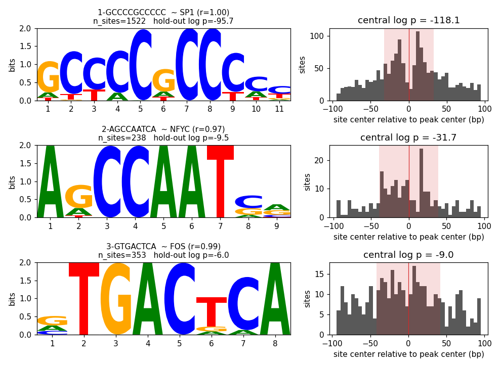

# pystreme

GPU-batched reimplementation of [STREME](https://meme-suite.org/meme/doc/streme.html)
for de novo motif discovery, callable in-process from Python and Jupyter:
no subprocess, no FASTA round trip, results as `Motif` objects, DataFrames
and figures.

```python
from pystreme import MotifDiscovery, summary

disc = MotifDiscovery.from_bed("peaks.bed", "genome.fa", size=200, device="cuda")
motifs = disc.fit(n_motifs=3)
summary(motifs)
```

## What it does

- **Fixed-width extraction** around peak centers (HOMER `-size` semantics),
  2-bit encoded, GPU-resident, with an order-k Markov background fitted on
  the control set.
- **STREME-style round loop** (`fit`): dinucleotide-shuffled (or GC-matched,
  or explicit) control, hold-out split, k-mer seeds, batched-convolution PWM
  refinement, hold-out re-test of each motif's threshold, site erasing,
  patience-based stopping.
- **Positional output for free**: per-site offsets from the peak center and a
  CentriMo-style central-enrichment statistic, which separates the bound
  factor's own motif from co-occurring ones.
- **Independently useful pieces**: a batched PWM scanner (`scan`), a
  SEA-style enrichment test for a known motif (`enrichment`), tables
  (`summary`, `sites_frame`), database annotation (`annotate`), logos and
  positional histograms (`plot`), MEME-format export (`to_meme`).



## Does it work?

Yes, measured against the real thing -- see [Validation and benchmarks](benchmarks.md):

| | pystreme | STREME 5.5.0 |
|---|---|---|
| 7232 SP1 ChEC-seq peaks, 10 motifs | same primary motif, 8 of 10 shared (Tomtom) | |
| wall-clock, one A40 (reserved) | **62 s** | 191 s |
| scanner vs FIMO (L1) | Pearson r = 1.00000, 99.95% identical best sites | |

## Where to go next

- [Usage guide](usage.md): every argument of `fit`, how to read a `Motif`,
  controls, exports, pitfalls.
- [Running on a cluster](cluster.md): LSF and SLURM recipes, and the
  pitfalls of shared clusters.
- [Design document](design.md): why it is built this way, and what was
  deliberately left out.
- [API reference](api/discovery.md).

## Status

Phases 0-5 of the design document are done. Not done by choice: a yeast
ChEC-seq regime for the STREME head-to-head, and repeat-aware GC matching.
